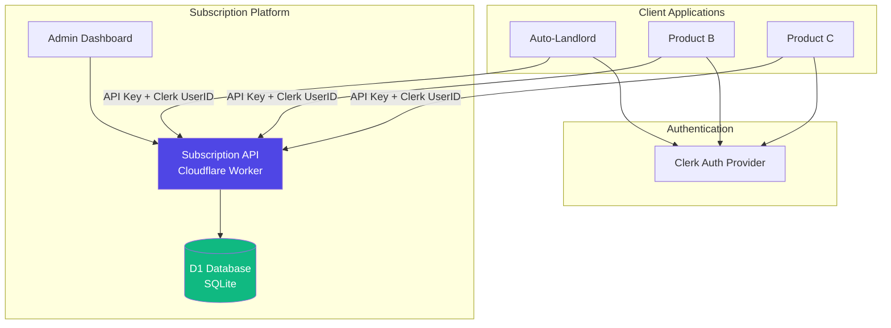
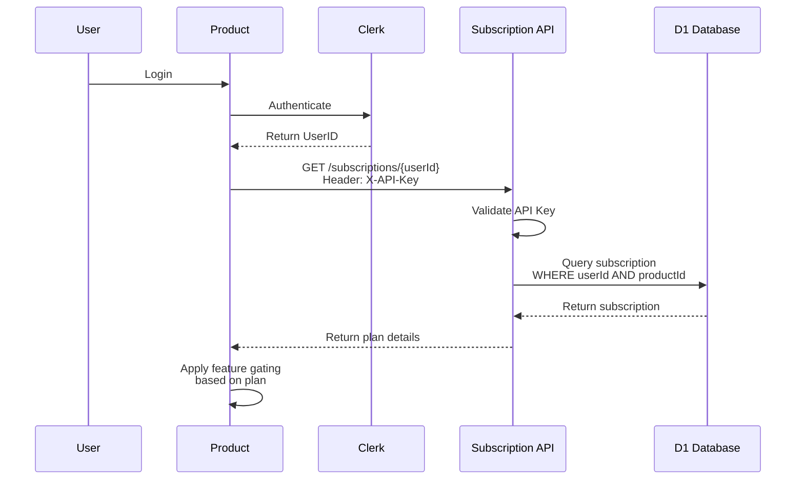

# Subscription Platform - Overview

A centralized subscription management platform designed to serve multiple products via token-based API.

## Purpose

This platform enables:

- **Multi-Product Support**: Single subscription service serving multiple SaaS applications
- **Centralized Billing**: Unified payment processing and verification
- **Scalable Architecture**: Independent microservice that can scale separately from products
- **Security**: API key-based authentication with rate limiting

## High-Level Architecture

## Technology Stack

- **Runtime**: Cloudflare Workers (Edge Computing)
- **Framework**: Hono (lightweight web framework)
- **Database**: Cloudflare D1 (SQLite at the edge)
- **ORM**: Drizzle ORM
- **Authentication**: Product API Keys + Clerk User IDs

## Design Principles

### 1. Product Isolation

Each product has:

- Unique API key for authentication
- Independent subscription records
- Isolated billing cycles

### 2. Stateless Architecture

- No session management
- Each request authenticated via API key
- User identification via Clerk UserID

### 3. Multi-Tenant Ready

- Single database serves all products
- `product_id` foreign key ensures data isolation
- Query filtering by product context

### 4. Admin-First Verification

- Manual payment approval workflow
- Admin dashboard for verification
- Audit trail for compliance

## Request Flow

## Core Entities

### Products

Registered applications that can query subscriptions

- Auto-Landlord
- Future Product B
- Future Product C

### Plans

Pricing tiers with feature limits

- Starter (Free)
- Pro
- Enterprise

### Subscriptions

User's active plan for a specific product

- Links user → plan → product
- Tracks payment proof and verification status

## Next Steps

1. Review [Database Schema](./01_database_schema.md)
2. Understand [API Endpoints](./02_api_endpoints.md)
3. Explore [Features](./03_features.md)
4. Learn about [Security](./04_security.md)
5. Setup [Deployment](./05_deployment.md)
