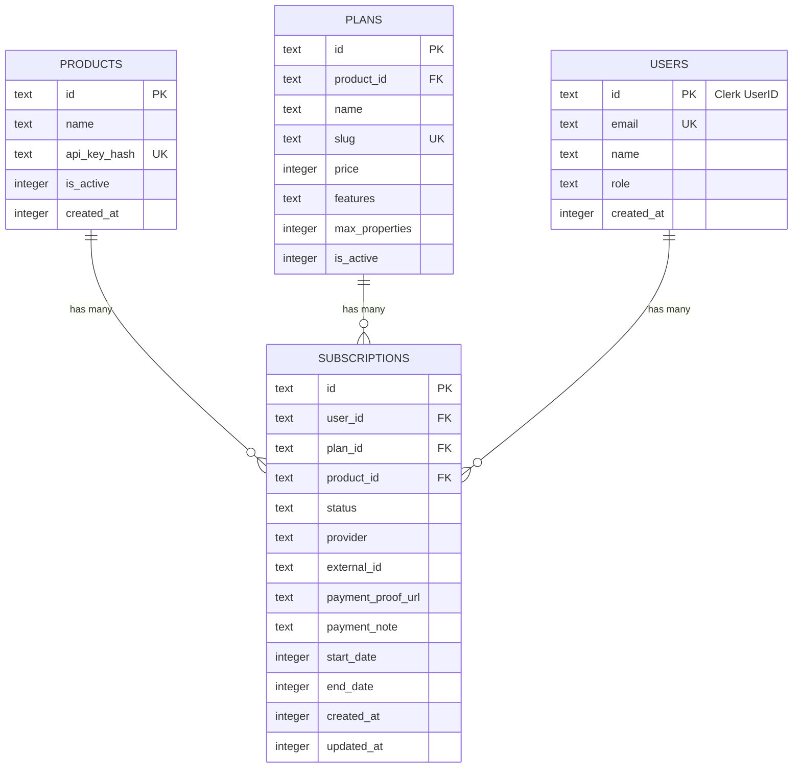

# Database Schema

Complete database schema for the subscription platform using Drizzle ORM with SQLite.

## Entity Relationship Diagram



## Table Definitions

### `products`

Registered applications that can query the subscription service.

```typescript
export const products = sqliteTable("products", {
  id: text("id")
    .primaryKey()
    .$defaultFn(() => crypto.randomUUID()),
  
  name: text("name").notNull(),
  // Product display name (e.g., "Auto-Landlord")
  
  apiKeyHash: text("api_key_hash").notNull().unique(),
  // Bcrypt hash of the product's API key
  // Never store plain text API keys
  
  isActive: integer("is_active", { mode: "boolean" })
    .notNull()
    .default(true),
  // Administrative flag to disable a product
  
  createdAt: integer("created_at", { mode: "timestamp" })
    .notNull()
    .$defaultFn(() => new Date()),
});
```

**Example Data**:
```sql
INSERT INTO products (id, name, api_key_hash, is_active)
VALUES 
  ('auto-landlord', 'Auto-Landlord', '$2a$10$...', 1),
  ('product-b', 'Product B', '$2a$10$...', 1);
```

---

### `plans`

Pricing tiers per product with feature limits.

```typescript
export const plans = sqliteTable("plans", {
  id: text("id")
    .primaryKey()
    .$defaultFn(() => crypto.randomUUID()),
  
  productId: text("product_id")
    .notNull()
    .references(() => products.id),
  // Which product this plan belongs to
  
  name: text("name").notNull(),
  // Display name (e.g., "Starter", "Pro", "Enterprise")
  
  slug: text("slug").notNull().unique(),
  // URL-safe identifier (e.g., "auto-landlord-pro")
  
  price: integer("price").notNull(),
  // Price in cents (e.g., 2900 = $29.00)
  
  features: text("features").notNull(),
  // Comma-separated feature list for display
  
  maxProperties: integer("max_properties").notNull(),
  // Feature gate: maximum properties allowed
  
  isActive: integer("is_active", { mode: "boolean" })
    .notNull()
    .default(true),
  // Administrative flag to hide/show plans
});
```

**Example Data**:
```sql
INSERT INTO plans (id, product_id, name, slug, price, features, max_properties)
VALUES 
  ('plan-001', 'auto-landlord', 'Starter', 'auto-landlord-starter', 0, 
   'Up to 2 properties,Basic tenant management,Email support', 2),
  ('plan-002', 'auto-landlord', 'Pro', 'auto-landlord-pro', 2900, 
   'Unlimited properties,Advanced reporting,Priority support', 999999);
```

---

### `users`

User accounts synchronized from Clerk.

```typescript
export const users = sqliteTable("users", {
  id: text("id").primaryKey(),
  // Clerk UserID - serves as primary key
  
  email: text("email").notNull().unique(),
  
  name: text("name"),
  // Optional display name
  
  role: text("role").notNull().default("USER"),
  // USER | SUPER_ADMIN
  // SUPER_ADMIN can approve payments
  
  createdAt: integer("created_at", { mode: "timestamp" })
    .notNull()
    .$defaultFn(() => new Date()),
  
  updatedAt: integer("updated_at", { mode: "timestamp" })
    .notNull()
    .$defaultFn(() => new Date()),
});
```

---

### `subscriptions`

User's active subscription for a specific product.

```typescript
export const subscriptions = sqliteTable("subscriptions", {
  id: text("id")
    .primaryKey()
    .$defaultFn(() => crypto.randomUUID()),
  
  userId: text("user_id")
    .notNull()
    .references(() => users.id),
  // Which user owns this subscription
  
  planId: text("plan_id")
    .notNull()
    .references(() => plans.id),
  // Current plan
  
  productId: text("product_id")
    .notNull()
    .references(() => products.id),
  // Which product this subscription is for
  
  status: text("status").notNull(),
  // active | pending_verification | past_due | canceled
  
  provider: text("provider").default("MANUAL"),
  // MANUAL | STRIPE | PAYPAL | SYSTEM
  
  externalId: text("external_id"),
  // External payment gateway transaction ID
  
  paymentProofUrl: text("payment_proof_url"),
  // URL to uploaded receipt (from R2)
  
  paymentNote: text("payment_note"),
  // User's message with payment details
  
  startDate: integer("start_date", { mode: "timestamp" }),
  // When subscription became active
  
  endDate: integer("end_date", { mode: "timestamp" }),
  // When subscription expires (null = lifetime/active)
  
  createdAt: integer("created_at", { mode: "timestamp" })
    .notNull()
    .$defaultFn(() => new Date()),
  
  updatedAt: integer("updated_at", { mode: "timestamp" })
    .notNull()
    .$defaultFn(() => new Date()),
});
```

**Status States**:
- `active`: User can access paid features
- `pending_verification`: Manual payment submitted, awaiting admin approval
- `past_due`: Payment failed or expired
- `canceled`: User canceled or admin rejected

---

## Indexes

For optimal query performance:

```sql
-- Subscription lookup by user and product
CREATE INDEX idx_subscriptions_user_product 
ON subscriptions(user_id, product_id);

-- Pending verifications for admin dashboard
CREATE INDEX idx_subscriptions_status 
ON subscriptions(status);

-- Plan lookup by product
CREATE INDEX idx_plans_product 
ON plans(product_id);
```

---

## Key Relationships

### One User, Multiple Subscriptions
A user can have different subscriptions for different products:
```
User: john@example.com
├─ Subscription 1: Auto-Landlord Pro
└─ Subscription 2: Product B Starter
```

### One Product, Multiple Plans
Each product defines its own pricing tiers:
```
Product: Auto-Landlord
├─ Plan: Starter (Free)
├─ Plan: Pro ($29/mo)
└─ Plan: Enterprise ($99/mo)
```

### Product Isolation
Queries always filter by `product_id`:
```typescript
// Get user's subscription for Auto-Landlord
const sub = await db.query.subscriptions.findFirst({
  where: and(
    eq(subscriptions.userId, userId),
    eq(subscriptions.productId, 'auto-landlord')
  )
});
```

---

## Migration Strategy

### Phase 1: Add Products Table
```sql
CREATE TABLE products (...);
INSERT INTO products VALUES ('auto-landlord', ...);
```

### Phase 2: Add product_id to Subscriptions
```sql
ALTER TABLE subscriptions ADD COLUMN product_id TEXT;
UPDATE subscriptions SET product_id = 'auto-landlord';
```

### Phase 3: Update Plans
```sql
ALTER TABLE plans ADD COLUMN product_id TEXT;
UPDATE plans SET product_id = 'auto-landlord';
```

See [05_deployment.md](./05_deployment.md) for detailed migration steps.
