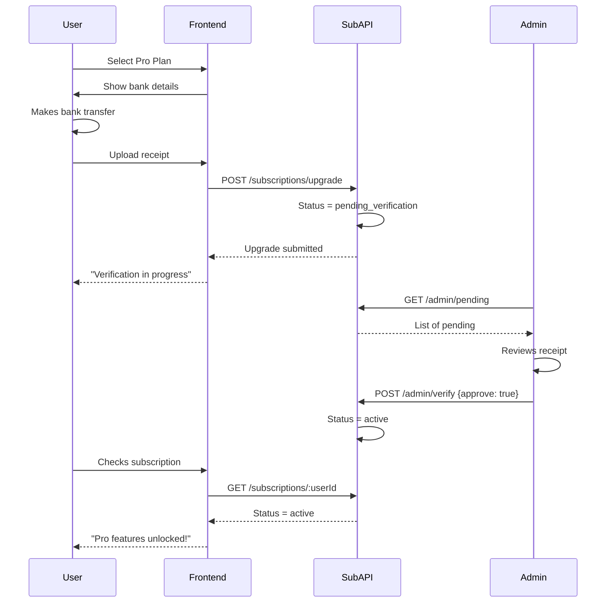
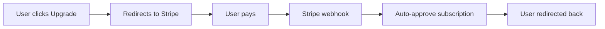

# Features

Detailed breakdown of subscription platform features and implementation approach.

## Core Features

### 1. Multi-Product Support

**Goal**: Single subscription service serves multiple SaaS applications.

**Implementation**:
- Each product registers with unique API key
- `products` table stores product metadata
- All subscriptions linked to `product_id`

**User Experience**:
```
User: sarah@example.com
├─ Auto-Landlord: Pro Plan ($29/mo)
├─ Product B: Starter (Free)
└─ Product C: Enterprise ($99/mo)
```

**Business Model Options**:

| Model | Description | Revenue | Complexity |
|-------|-------------|---------|------------|
| **Per-Product** | Users pay separately for each product | Higher potential | Low |
| **Cross-Product** | One subscription unlocks all products | Simpler for users | Medium |
| **Hybrid** | Bundle discounts for multiple products | Best of both | High |

**Current Recommendation**: Start with **Per-Product** for simplicity.

---

### 2. Manual Payment Verification

**Goal**: Support international payments via bank transfer and manual verification.

**Flow**:



**Features**:
- Receipt upload to Cloudflare R2
- Admin dashboard shows pending approvals
- Payment note for transaction reference
- Email notifications (future)

---

### 3. Feature Gating

**Goal**: Restrict features based on user's subscription plan.

**Approach**:

#### Frontend Gating
```typescript
// React component
const { subscription } = useSubscription();

if (subscription?.plan.maxProperties <= currentPropertyCount) {
  return <UpgradeModal />;
}

return <AddPropertyButton />;
```

#### Backend Gating
```typescript
// API middleware
async function createProperty(c) {
  const userId = c.get('userId');
  
  // Check subscription
  const sub = await getSubscription(userId);
  const currentCount = await countProperties(userId);
  
  if (currentCount >= sub.plan.maxProperties) {
    throw new HTTPException(403, { 
      message: `Limit reached. Upgrade to create more.` 
    });
  }
  
  // Proceed with creation
}
```

**Common Limits**:
- `maxProperties`: Number of properties allowed
- `maxTenants`: Number of tenant accounts
- `advancedReporting`: Boolean feature flag
- `prioritySupport`: Support tier

---

### 4. API Key Management

**Goal**: Secure product-to-subscription communication.

**Key Generation**:
```typescript
import bcrypt from 'bcryptjs';

// Generate random API key
const apiKey = crypto.randomUUID(); // e.g., "al_prod_a1b2c3d4e5f6"

// Hash before storing
const apiKeyHash = await bcrypt.hash(apiKey, 10);

// Store in database
await db.insert(products).values({
  id: 'auto-landlord',
  name: 'Auto-Landlord',
  apiKeyHash,
});

// Give plain key to product owner ONCE
console.log('API Key (save this):', apiKey);
```

**Validation**:
```typescript
// Middleware
const validateApiKey = async (c, next) => {
  const apiKey = c.req.header('X-API-Key');
  
  if (!apiKey) {
    throw new HTTPException(401, { message: 'Missing API key' });
  }
  
  // Find product by comparing hashes
  const products = await db.query.products.findMany();
  
  for (const product of products) {
    const isValid = await bcrypt.compare(apiKey, product.apiKeyHash);
    if (isValid && product.isActive) {
      c.set('productId', product.id);
      return await next();
    }
  }
  
  throw new HTTPException(401, { message: 'Invalid API key' });
};
```

**Key Rotation**:
1. Generate new key
2. Update `apiKeyHash` in database
3. Update environment variable in product
4. Verify connection
5. Old key automatically invalidated

---

### 5. Rate Limiting

**Goal**: Prevent abuse and ensure fair usage.

**Implementation**:
```typescript
// Cloudflare Workers KV for storage
const rateLimiter = async (c, next) => {
  const productId = c.get('productId');
  const key = `ratelimit:${productId}:${Math.floor(Date.now() / 60000)}`;
  
  const count = await c.env.RATE_LIMIT_KV.get(key);
  
  if (count && parseInt(count) >= 100) {
    throw new HTTPException(429, { 
      message: 'Rate limit exceeded' 
    });
  }
  
  await c.env.RATE_LIMIT_KV.put(
    key, 
    String((parseInt(count || '0') + 1)),
    { expirationTtl: 60 }
  );
  
  await next();
};
```

**Limits by Endpoint**:
- Standard: 100 req/min
- Admin: 1000 req/min
- Webhooks: 10 req/min

---

## Future Features

### 6. Automated Payment Integration

**Goal**: Support Stripe/PayPal for automated billing.

**Flow**:


**Implementation**:
- `POST /webhooks/stripe` endpoint
- Verify webhook signature
- Update subscription status
- No admin approval needed

---

### 7. Usage Metering

**Goal**: Track API usage for billing.

**Approach**:
```typescript
// Log each request
await db.insert(usage_logs).values({
  subscriptionId,
  endpoint: '/properties',
  timestamp: new Date(),
});

// Monthly rollup
const usage = await db
  .select({ count: sql`count(*)` })
  .from(usage_logs)
  .where(eq(usage_logs.subscriptionId, subId));
```

**Use Cases**:
- Pay-per-API-call pricing
- Overage fees
- Usage analytics

---

### 8. Subscription Analytics

**Goal**: Track MRR, churn, conversions.

**Metrics**:
- Monthly Recurring Revenue (MRR)
- Customer Lifetime Value (LTV)
- Churn rate
- Upgrade conversion rate

**Dashboard**:
```
Total Active Subscriptions: 1,234
MRR: $35,586
Average Revenue Per User: $28.84
Churn (30-day): 3.2%
```

---

### 9. Multi-Currency Support

**Goal**: Display prices in user's local currency.

**Implementation**:
```typescript
// Store prices in cents (USD base)
const plans = [
  { slug: 'pro', priceUSD: 2900 }
];

// Convert on-the-fly
const getLocalizedPrice = (priceUSD, currency) => {
  const rates = { USD: 1, EUR: 0.92, IDR: 15600 };
  return Math.round(priceUSD * rates[currency]);
};
```

---

### 10. Team/Organization Accounts

**Goal**: Allow companies to manage multiple user seats.

**Schema Addition**:
```typescript
export const organizations = sqliteTable("organizations", {
  id: text("id").primaryKey(),
  name: text("name"),
  subscriptionId: text("subscription_id"),
});

export const organization_members = sqliteTable("organization_members", {
  organizationId: text("organization_id"),
  userId: text("user_id"),
  role: text("role"), // admin, member
});
```

**Flow**:
- Organization owner pays for N seats
- Invites team members via email
- All members inherit organization's plan

---

## Implementation Priority

### Phase 1 (MVP)
- [x] Multi-product support
- [x] Manual payment verification
- [x] Feature gating
- [x] API key management

### Phase 2
- [ ] Rate limiting
- [ ] Admin analytics dashboard
- [ ] Email notifications

### Phase 3
- [ ] Stripe integration
- [ ] Usage metering
- [ ] Multi-currency

### Phase 4
- [ ] Team accounts
- [ ] Advanced analytics
- [ ] Customer portal
