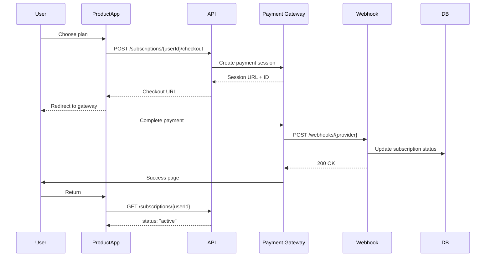

# Phase 3: Automated Payment Gateways - Implementation Plan

**Status:** 📋 Planning  
**Dependencies:** Phase 2 Complete ✅  
**Target:** Q1 2024

---

## 🎯 Goals

Transform the subscription platform from manual payment verification to automated, real-time payment processing with support for multiple payment gateways.

**Key Objectives:**

1. Integrate Stripe for international payments
2. Integrate Midtrans for Indonesian payments
3. Integrate Xendit as backup Indonesian gateway
4. Implement webhook handlers for real-time verification
5. Add recurring billing support
6. Enable instant subscription activation

---

## 📊 Architecture Overview

### Payment Flow Comparison

**Current (Phase 2 - Manual):**

```
User → Manual Payment → Upload Proof → Admin Approval → Active (30+ min)
```

**Phase 3 (Automated):**

```
User → Payment Gateway → Webhook → Auto-Verification → Active (<1 min)
```

### System Architecture



---

## 🗄️ Database Changes

### New Tables

#### `payment_transactions`

Track all payment attempts and transactions.

```sql
CREATE TABLE payment_transactions (
  id TEXT PRIMARY KEY,
  subscription_id TEXT NOT NULL,
  payment_method_id TEXT NOT NULL,

  -- Gateway info
  provider TEXT NOT NULL, -- 'stripe', 'midtrans', 'xendit'
  external_transaction_id TEXT,

  -- Amount
  amount INTEGER NOT NULL,
  currency TEXT NOT NULL DEFAULT 'IDR',

  -- Status
  status TEXT NOT NULL, -- 'pending', 'processing', 'success', 'failed', 'refunded'

  -- Payment details
  payment_url TEXT,
  payment_method_type TEXT, -- 'credit_card', 'bank_transfer', 'e_wallet'

  -- Timestamps
  paid_at INTEGER,
  expires_at INTEGER,
  created_at INTEGER NOT NULL,
  updated_at INTEGER NOT NULL,

  FOREIGN KEY (subscription_id) REFERENCES subscriptions(id) ON DELETE CASCADE,
  FOREIGN KEY (payment_method_id) REFERENCES payment_methods(id)
);
```

#### `webhook_events`

Log all webhook events for debugging and replay.

```sql
CREATE TABLE webhook_events (
  id TEXT PRIMARY KEY,
  provider TEXT NOT NULL,

  -- Request data
  event_type TEXT NOT NULL,
  payload TEXT NOT NULL, -- JSON
  signature TEXT,

  -- Processing
  status TEXT NOT NULL DEFAULT 'pending', -- 'pending', 'processed', 'failed'
  processed_at INTEGER,
  error_message TEXT,
  retry_count INTEGER DEFAULT 0,

  -- Audit
  ip_address TEXT,
  created_at INTEGER NOT NULL
);

CREATE INDEX idx_webhook_status ON webhook_events(status);
CREATE INDEX idx_webhook_provider_type ON webhook_events(provider, event_type);
```

### Updated Tables

#### `subscriptions`

Add recurring billing fields.

```sql
ALTER TABLE subscriptions ADD COLUMN billing_cycle TEXT; -- 'monthly', 'yearly', 'one_time'
ALTER TABLE subscriptions ADD COLUMN next_billing_date INTEGER;
ALTER TABLE subscriptions ADD COLUMN auto_renew INTEGER DEFAULT 1;
ALTER TABLE subscriptions ADD COLUMN canceled_at INTEGER;
```

#### `payment_methods`

Add provider credentials.

```sql
ALTER TABLE payment_methods ADD COLUMN credentials TEXT; -- Encrypted JSON
ALTER TABLE payment_methods ADD COLUMN webhook_secret TEXT;
ALTER TABLE payment_methods ADD COLUMN is_test_mode INTEGER DEFAULT 0;
```

---

## 🔌 Payment Gateway Integration

### 1. Stripe Integration

**Use Case:** International payments, credit cards, global coverage

**Implementation:**

```typescript
// apps/backend/src/features/payments/providers/stripe.ts
import Stripe from "stripe";

export class StripeProvider {
  private stripe: Stripe;

  constructor(apiKey: string) {
    this.stripe = new Stripe(apiKey, {
      apiVersion: "2023-10-16",
    });
  }

  async createCheckoutSession(data: {
    amount: number;
    currency: string;
    userId: string;
    planId: string;
    subscriptionId: string;
  }) {
    const session = await this.stripe.checkout.sessions.create({
      mode: "payment",
      payment_method_types: ["card"],
      line_items: [
        {
          price_data: {
            currency: data.currency,
            product_data: { name: "Subscription" },
            unit_amount: data.amount,
          },
          quantity: 1,
        },
      ],
      metadata: {
        userId: data.userId,
        planId: data.planId,
        subscriptionId: data.subscriptionId,
      },
      success_url: `${process.env.PRODUCT_URL}/payment/success`,
      cancel_url: `${process.env.PRODUCT_URL}/payment/cancel`,
    });

    return {
      sessionId: session.id,
      checkoutUrl: session.url,
      expiresAt: new Date(session.expires_at * 1000),
    };
  }

  async verifyWebhook(
    payload: string,
    signature: string
  ): Promise<Stripe.Event> {
    return this.stripe.webhooks.constructEvent(
      payload,
      signature,
      process.env.STRIPE_WEBHOOK_SECRET
    );
  }

  async handleWebhookEvent(event: Stripe.Event) {
    switch (event.type) {
      case "checkout.session.completed":
        return this.handleCheckoutCompleted(event.data.object);
      case "payment_intent.succeeded":
        return this.handlePaymentSucceeded(event.data.object);
      case "payment_intent.failed":
        return this.handlePaymentFailed(event.data.object);
      default:
        console.log(`Unhandled event type: ${event.type}`);
    }
  }

  private async handleCheckoutCompleted(session: any) {
    const { userId, subscriptionId } = session.metadata;

    // Update subscription status to active
    return {
      subscriptionId,
      status: "active",
      externalId: session.id,
    };
  }
}
```

**Configuration:**

```json
{
  "slug": "stripe",
  "name": "Credit Card (Stripe)",
  "type": "automated",
  "provider": "stripe",
  "config": null,
  "credentials": "{\"apiKey\":\"sk_live_...\",\"publicKey\":\"pk_live_...\"}",
  "webhook_secret": "whsec_..."
}
```

---

### 2. Midtrans Integration

**Use Case:** Indonesian market, local payment methods (GoPay, OVO, QRIS, Bank Transfer)

**Implementation:**

```typescript
// apps/backend/src/features/payments/providers/midtrans.ts
import snap from "midtrans-client";

export class MidtransProvider {
  private snap: any;

  constructor(serverKey: string, isProduction: boolean) {
    this.snap = new snap({
      isProduction,
      serverKey,
    });
  }

  async createTransaction(data: {
    amount: number;
    userId: string;
    planId: string;
    subscriptionId: string;
    customerEmail: string;
  }) {
    const parameter = {
      transaction_details: {
        order_id: data.subscriptionId,
        gross_amount: data.amount,
      },
      customer_details: {
        email: data.customerEmail,
        user_id: data.userId,
      },
      enabled_payments: [
        "credit_card",
        "gopay",
        "shopeepay",
        "other_qris",
        "bca_va",
        "bni_va",
        "bri_va",
      ],
      custom_field1: data.planId,
    };

    const transaction = await this.snap.createTransaction(parameter);

    return {
      token: transaction.token,
      checkoutUrl: transaction.redirect_url,
      expiresAt: new Date(Date.now() + 24 * 60 * 60 * 1000), // 24 hours
    };
  }

  async verifySignature(data: any, signature: string): Promise<boolean> {
    const crypto = require("crypto");
    const serverKey = this.snap.apiConfig.serverKey;

    const signatureKey = crypto
      .createHash("sha512")
      .update(
        `${data.order_id}${data.status_code}${data.gross_amount}${serverKey}`
      )
      .digest("hex");

    return signatureKey === signature;
  }

  async handleNotification(notification: any) {
    const transactionStatus = notification.transaction_status;
    const fraudStatus = notification.fraud_status;
    const orderId = notification.order_id; // subscription_id

    let status = "pending";

    if (transactionStatus === "capture") {
      status = fraudStatus === "accept" ? "active" : "pending";
    } else if (transactionStatus === "settlement") {
      status = "active";
    } else if (["cancel", "deny", "expire"].includes(transactionStatus)) {
      status = "canceled";
    }

    return {
      subscriptionId: orderId,
      status,
      externalId: notification.transaction_id,
      paymentType: notification.payment_type,
    };
  }
}
```

**Configuration:**

```json
{
  "slug": "midtrans",
  "name": "Indonesian Payments (Midtrans)",
  "type": "automated",
  "provider": "midtrans",
  "config": "{\"enabledPayments\":[\"gopay\",\"qris\",\"bank_transfer\"]}",
  "credentials": "{\"serverKey\":\"...\",\"clientKey\":\"...\"}",
  "webhook_secret": null
}
```

---

### 3. Xendit Integration

**Use Case:** Backup for Midtrans, more Indonesian payment methods

**Implementation: Similar pattern to Midtrans**

---

## 🎣 Webhook Handler Architecture

### Unified Webhook Endpoint

```typescript
// apps/backend/src/features/webhooks/index.ts
export const registerWebhooks = (app: Hono) => {
  // Stripe webhook
  app.post("/webhooks/stripe", async (c) => {
    const signature = c.req.header("stripe-signature");
    const payload = await c.req.text();

    try {
      const event = stripeProvider.verifyWebhook(payload, signature);

      // Log webhook
      await logWebhookEvent("stripe", event.type, payload);

      // Process event
      const result = await stripeProvider.handleWebhookEvent(event);

      if (result) {
        await updateSubscriptionStatus(result);
      }

      return c.json({ received: true });
    } catch (error) {
      return c.json({ error: "Webhook verification failed" }, 400);
    }
  });

  // Midtrans webhook
  app.post("/webhooks/midtrans", async (c) => {
    const notification = await c.req.json();
    const signature = c.req.header("x-signature");

    try {
      const isValid = await midtransProvider.verifySignature(
        notification,
        signature
      );

      if (!isValid) {
        throw new Error("Invalid signature");
      }

      await logWebhookEvent(
        "midtrans",
        notification.transaction_status,
        notification
      );

      const result = await midtransProvider.handleNotification(notification);
      await updateSubscriptionStatus(result);

      return c.json({ success: true });
    } catch (error) {
      return c.json({ error: "Webhook processing failed" }, 400);
    }
  });
};
```

### Webhook Processing Service

```typescript
// apps/backend/src/features/webhooks/service.ts
export class WebhookService {
  async logEvent(provider: string, eventType: string, payload: any) {
    await db.insert(webhookEvents).values({
      id: crypto.randomUUID(),
      provider,
      eventType,
      payload: JSON.stringify(payload),
      status: "pending",
      createdAt: new Date(),
    });
  }

  async processEvent(eventId: string) {
    const event = await db.query.webhookEvents.findFirst({
      where: eq(webhookEvents.id, eventId),
    });

    try {
      // Process based on provider
      const result = await this.processProviderEvent(event);

      // Mark as processed
      await db
        .update(webhookEvents)
        .set({
          status: "processed",
          processedAt: new Date(),
        })
        .where(eq(webhookEvents.id, eventId));

      return result;
    } catch (error) {
      // Mark as failed, retry later
      await db
        .update(webhookEvents)
        .set({
          status: "failed",
          errorMessage: error.message,
          retryCount: event.retryCount + 1,
        })
        .where(eq(webhookEvents.id, eventId));

      throw error;
    }
  }

  async retryFailedEvents() {
    const failedEvents = await db.query.webhookEvents.findMany({
      where: and(
        eq(webhookEvents.status, "failed"),
        lt(webhookEvents.retryCount, 3)
      ),
    });

    for (const event of failedEvents) {
      await this.processEvent(event.id);
    }
  }
}
```

---

## 🔄 New API Endpoints

### Create Checkout Session

```typescript
POST /subscriptions/{userId}/checkout
Authorization: X-API-Key

Request:
{
  "productId": "auto-landlord",
  "planId": "plan_pro",
  "paymentMethodId": "pm_stripe" // or "pm_midtrans"
}

Response:
{
  "subscriptionId": "sub_123",
  "checkoutUrl": "https://checkout.stripe.com/...",
  "expiresAt": "2024-01-24T10:00:00Z",
  "status": "pending_payment"
}
```

### Check Payment Status

```typescript
GET /subscriptions/{userId}/payment-status/{subscriptionId}
Authorization: X-API-Key

Response:
{
  "subscriptionId": "sub_123",
  "status": "active", // or "pending_payment", "failed"
  "paidAt": "2024-01-23T10:05:32Z",
  "transactionId": "txn_123"
}
```

---

## 🔒 Security Considerations

### 1. Webhook Signature Verification

- Always verify webhook signatures
- Reject unsigned requests
- Log suspicious requests

### 2. Credential Encryption

```typescript
// Encrypt payment gateway credentials
import { encrypt, decrypt } from "@/lib/encryption";

async function savePaymentMethod(data) {
  const encryptedCreds = encrypt(JSON.stringify(data.credentials));

  await db.insert(paymentMethods).values({
    ...data,
    credentials: encryptedCreds,
  });
}
```

### 3. Idempotency

- Handle duplicate webhooks gracefully
- Use transaction IDs to prevent double-processing
- Implement database transactions

### 4. Rate Limiting

- Separate rate limits for webhooks
- Allow burst traffic from payment providers
- Monitor for webhook flooding attacks

---

## 📋 Implementation Checklist

### Phase 3.1: Foundation (Week 1-2)

- [ ] Create migration for new tables
- [ ] Implement encryption for credentials
- [ ] Create payment provider interface
- [ ] Add webhook logging system

### Phase 3.2: Stripe Integration (Week 3-4)

- [ ] Implement Stripe provider class
- [ ] Create checkout endpoint
- [ ] Build webhook handler
- [ ] Test with Stripe test mode
- [ ] Add Stripe to admin UI

### Phase 3.3: Midtrans Integration (Week 5-6)

- [ ] Implement Midtrans provider class
- [ ] Create checkout endpoint
- [ ] Build webhook handler
- [ ] Test with Midtrans sandbox
- [ ] Add Midtrans to admin UI

### Phase 3.4: Xendit Integration (Week 7)

- [ ] Implement Xendit provider
- [ ] Setup webhooks
- [ ] Testing

### Phase 3.5: Recurring Billing (Week 8-9)

- [ ] Design subscription renewal flow
- [ ] Implement auto-renewal logic
- [ ] Create billing cycle management
- [ ] Add payment retry logic
- [ ] Email notifications for failed payments

### Phase 3.6: Testing & Deployment (Week 10)

- [ ] End-to-end testing
- [ ] Load testing for webhooks
- [ ] Security audit
- [ ] Documentation
- [ ] Production deployment

---

## 🚀 Deployment Strategy

### 1. Feature Flags

```typescript
const config = {
  stripeEnabled: env.ENABLE_STRIPE === "true",
  midtransEnabled: env.ENABLE_MIDTRANS === "true",
  xenditEnabled: env.ENABLE_XENDIT === "true",
};
```

### 2. Gradual Rollout

- Week 1: Internal testing
- Week 2: Beta users (10%)
- Week 3: Expanded (50%)
- Week 4: Full rollout (100%)

### 3. Monitoring

- Webhook processing time
- Payment success/failure rates
- Gateway response times
- Error rates per provider

---

## 📊 Success Metrics

- **Payment Success Rate:** >95%
- **Activation Time:** <1 minute
- **Webhook Processing:** <5 seconds
- **Gateway Uptime:** >99.9%
- **Failed Payment Retry:** 3 attempts

---

## 🔮 Future Enhancements (Phase 4)

- Usage-based billing
- Metered subscriptions
- Proration for plan changes
- Subscription analytics
- Payment method management (save cards)
- Subscription pause/resume
- Coupon and discount codes
- Multi-currency support
- Tax calculation integration

---

## 📚 Resources

**Stripe:**

- Docs: https://stripe.com/docs
- Webhooks: https://stripe.com/docs/webhooks
- Testing: https://stripe.com/docs/testing

**Midtrans:**

- Docs: https://docs.midtrans.com
- Snap API: https://snap-docs.midtrans.com
- Webhook: https://docs.midtrans.com/en/after-payment/http-notification

**Xendit:**

- Docs: https://docs.xendit.co
- API Reference: https://developers.xendit.co
